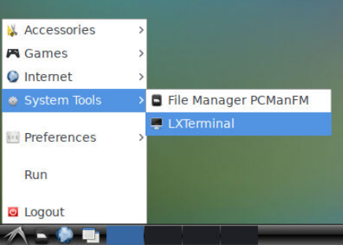
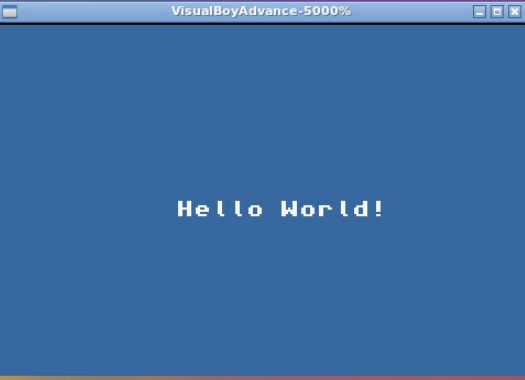

# GBA 開発環境 #
## 概要 ##
- Dockerを用いてGBA用の開発環境を構築した
- 使用しているライブラリは devkitpro である
  - https://github.com/devkitPro
- GBAのエミュレータは VisualBoyAdvance である
  - https://wiki.ubuntuusers.de/VisualBoyAdvance/
- サンプルプログラムは以下のものを使用
  - https://github.com/devkitPro/gba-examples

## Tutorial ##
1. リポジトリをクローンする
   ```
    $ git clone 
   ```
2. ターミナルを開き、以下のコマンドを入力
   ```
   $ 
   $ docker compose build && docker compose up -d
   ```
3. ブラウザで http://localhost:8080/ にアクセスすると以下のような画面が表示される
<center>

</center>

4. ブラウザ上でターミナルを開く
<center>

</center>

5. ターミナル上で以下のコマンドを実行し、サンプルプログラムをビルドし、templete.gbaを生成する。
   
```
$ cd /home/ubuntu/gba-examples/templete$ make
```
6.  エミュレータで実行する。
  ```
  $ vba --throttle=100 --filter-super-eagle template.gba
  ``` 
<center>

</center>
