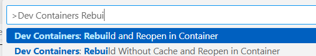
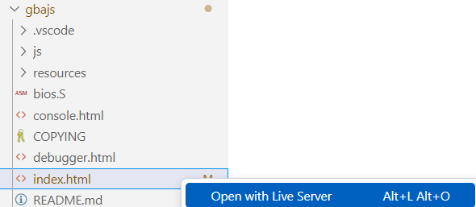
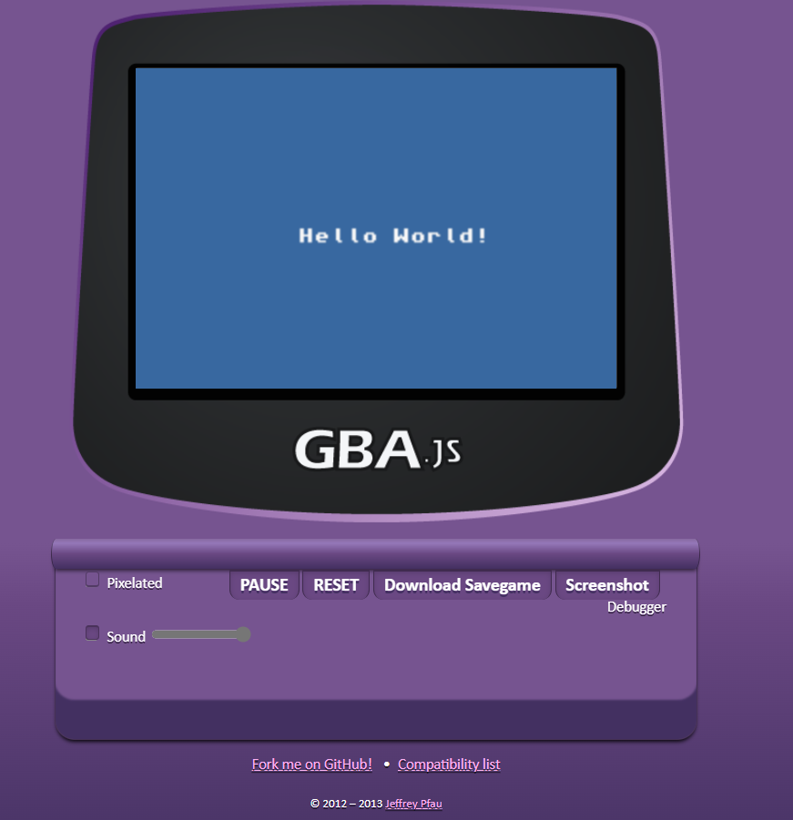
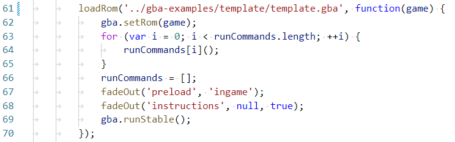

# GBA Develop Environment #
## Overview ##
Development environment for GBA using Visual Studio Code's devcontainer.

- toolchain</br>
https://github.com/devkitPro</br>
※Docker image is distributed. </br>
https://hub.docker.com/r/devkitpro/devkitarm

- emulator</br>
  https://github.com/endrift/gbajs

- sample code</br>
https://github.com/devkitPro/gba-examples

- Visual Studio Code 's devcontainer
https://code.visualstudio.com/docs/devcontainers/containers

---

## Quick Start ##
1. Install Docker </br>
- Windows </br>
  https://docs.docker.com/desktop/install/windows-install/

- Ubuntu </br>
  https://docs.docker.com/engine/install/ubuntu/

2. Install Visual Studio Code & set up Devcontainer </br>
  https://code.visualstudio.com/docs/devcontainers/tutorial

3. Clone this repository
  ```
  git clone https://github.com/mamoru1126/GBA_Devleop_Environment.git
  ```

4. Open in Visual Stduio Code

5. Ctrl + shift + p and Rebuild and Reopen in Container
<div align="center">

</div>

---

## Build sample code & Run gba file on the emulator ##
1. Open terminal in devcontainer

2. Enter the following command
  ```
 cd gba-examples
 cd template
 make
  ```

3. Open index.html in gbajs directory with Live Server
<div align="center">

</div>

</br>

4. The emulator starts and the gba file is automatically loaded.

</br>
<div align="center">

</div>

--- 

## Setting GBA File Path ##
<div align="center">

</div>


   
